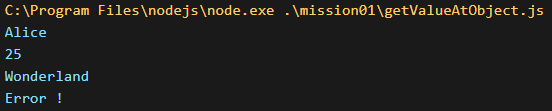
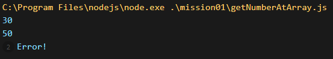

# mission01

## [getValueAtObject](https://github.com/MinQyu/js-homework/blob/main/mission01/getValueAtObject.js)

## [getNumberAtArray](https://github.com/MinQyu/js-homework/blob/main/mission01/getNumberAtArray.js)

